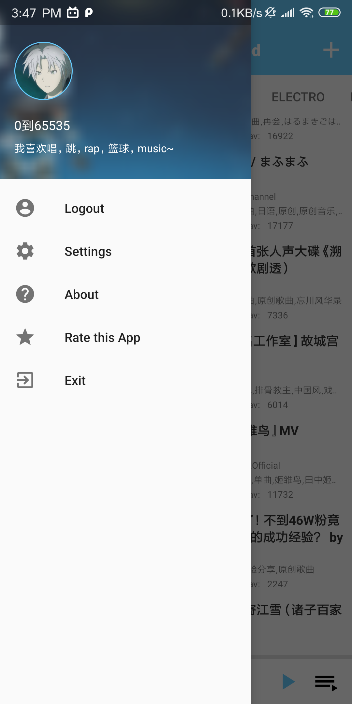
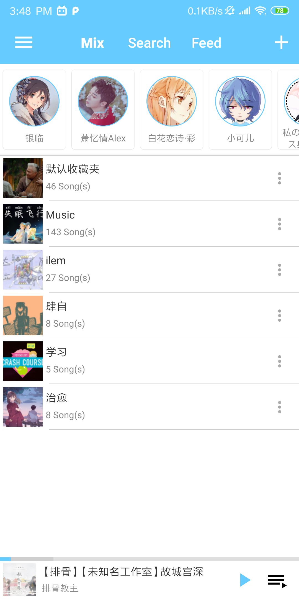
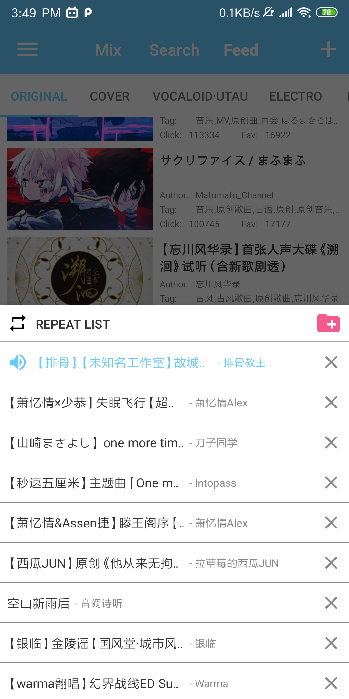

[](https://github.com/yangchenxi/BiliMusicPlayer/releases)


<a href="https://play.google.com/store/apps/details?id=net.chenxiy.bilimusic"></a>

# Due To the change Of API by Bilibili official, this app is temporily removed from Google Play Store, Coming back soon...

```
Warning:
This App has never been published in ANY App Store hosted in Mainland China. 
Downloads from these websites may cause security(e.g. password stolen) and legal risks.
```

# BiliMusic [中文](./README_CN.md)


BiliMusic is a third-party online music player for Android. It plays the music video from Bilibili.com (Chinese Youtube) as audio and sync with your bilibili account, using MVVM+Room+LiveData+Retrofit+Exoplayer.

Since there is no official API provided by bilibili.com, I analysed the website's frontend API by myself. **[API Document](./Core/Api.md)**

[Here is code for WebView traffic intercept](./Core/WebView)

## Preview 

#### Click to watch Youtube Demo:

[](https://www.youtube.com/watch?v=zlTDXCNf75c)

## Feature

* Multi-language support
* User login
* User mix folder sync (both public and private)
* Auto generate playlists by the author
* Add/Delete songs from mix folder
* Add/Delete mix folder
* Batch adding songs to mix folder
* Browse the online music resource ranked by click
* Search by author, name and id
* Get the music detail
* Open video of the music on bilibili.com
* Play in background | Lock screen control

## ScreenShots

| | | |
|:-------------------------:|:-------------------------:|:-------------------------:|
||||

## Download

### [Release-V2.0 2019-07-07](https://github.com/yangchenxi/BiliMusicPlayer/releases/download/2.0/BiliMusic2.0.apk)


```
Detail:

Fix some bugs
Add Traditional Chinese and English support
Possibly fixed the navigation bar overlap issue
Add feed period in settings
```

~~[Release-V1.0-Alpha 2019-04-18](https://github.com/yangchenxi/BiliMusicPlayer/releases/download/v1.0-alpha/BiliMusic.apk)~~

## Libraries

[Retrofit](https://github.com/square/retrofit)

[Gson](https://github.com/google/gson)

[ViewModel](https://developer.android.com/topic/libraries/architecture/viewmodel)

[LiveData](https://developer.android.com/topic/libraries/architecture/livedata)

[Glide](https://github.com/bumptech/glide)

[CircleImageView](https://github.com/hdodenhof/CircleImageView)

[Room](https://developer.android.com/topic/libraries/architecture/room)

[Exoplayer](https://github.com/google/ExoPlayer)

[DataBindingLibrary](https://developer.android.com/topic/libraries/data-binding)

[PagingLibrary](https://developer.android.com/topic/libraries/architecture/paging)

[SpinnerLoading](https://github.com/lusfold/SpinnerLoading)


## TODO:（Possibly...）

- [x] Add language support for 繁體中文、English（Including ReadmeFile）、~~日本語~~

- [ ] Save album photo

- [ ] Fix progress bar bugs for flv audio source

- [ ] Beautify UI

- [ ] Add Local Mix Folder

- [ ] Add offline mode and download function

- [ ] Add bilibili page resource support

- [ ] Add Dark Mode Support

   ...

## Claim：

**This app uses cookie to save user session, all cookies will be stored in local device**

**The copyrights of all music contents belongs to Bilibili.com**

**Welcome to Fork, Star, Follow, Pull Request**

## License:

Copyright(c) 2019 Chenxi Yang

MIT License


