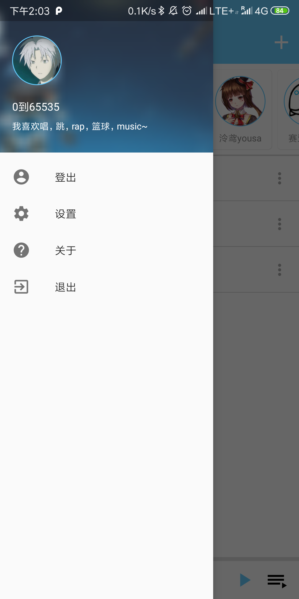
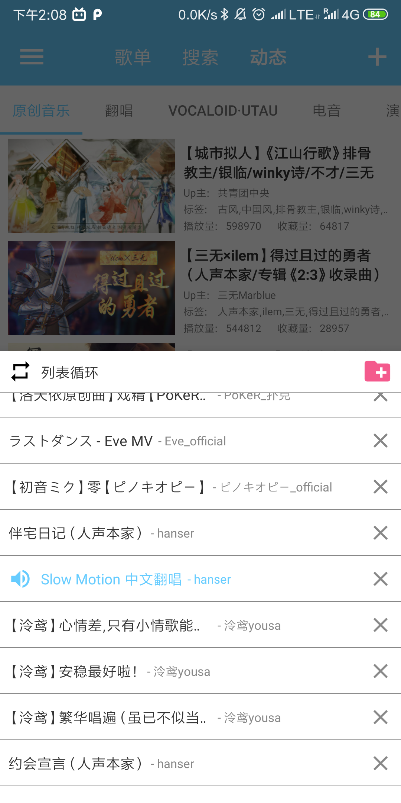
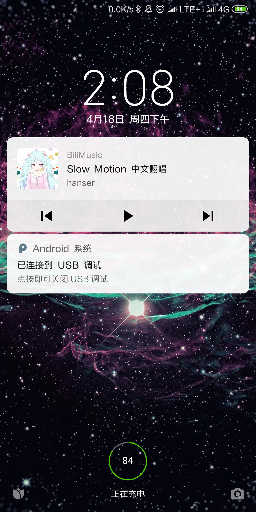

# BiliMusic

BiliMusic是一款安卓音乐播放器，将B站音乐区Up主投稿的翻唱，原创等视频作为音频在安卓客户端播放。还在不断完善之中，采用MVVM+LiveData+Retrofit+Exoplayer 实现。

相关Api分析自bilibili.com Web前端请求，[Api文档](./Core/Api.md)

[相关WebView请求过滤拦截实现](./Core/WebView)
## Preview

## Feature

* 用户登录
* 同步用户收藏夹(包括私有收藏夹)
* 自动生成按照Up主分类的播放列表
* 添加/删除收藏夹内歌曲
* 添加/删除收藏夹
* 批量添加当前播放列表歌曲到用户收藏夹
* 按热度排序浏览B站音乐区投稿
* 搜索Up主、av号
* 显示当前播放歌曲信息
* 在Bilibili App中播放当前音频的原视频
* 后台播放、锁屏控制

## ScreenShots

| | | |
|:-------------------------:|:-------------------------:|:-------------------------:|
||||

## Download

### [Release-V1.0-Alpha 2019-04-18](https://github.com/yangchenxi/BiliMusicPlayer/releases/download/v1.0-alpha/BiliMusic.apk)

## Libraries

[Retrofit](https://github.com/square/retrofit)

[Gson](https://github.com/google/gson)

[ViewModel](https://developer.android.com/topic/libraries/architecture/viewmodel)

[LiveData](https://developer.android.com/topic/libraries/architecture/livedata)

[Glide](https://github.com/bumptech/glide)

[CircleImageView](https://github.com/hdodenhof/CircleImageView)

[Room](https://developer.android.com/topic/libraries/architecture/room)

[Exoplayer](https://github.com/google/ExoPlayer)

[DataBindingLibrary](https://developer.android.com/topic/libraries/data-binding)

[PagingLibrary](https://developer.android.com/topic/libraries/architecture/paging)

[SpinnerLoading](https://github.com/lusfold/SpinnerLoading)

## TODO:

- [ ] 解决个别Flv音源返回格式无法拖动进度条的问题

- [ ] 美化UI

- [ ] 增加本地收藏夹功能

- [ ] 增加离线播放以及下载功能

- [ ] 增加分P播放功能

   ...

## 声明：

**本app通过模拟浏览器行为进行数据获取,会保存用户cookie用于api请求，相关数据将不会传送给任何第三方。**

**音乐版权归Bilibili所有。如果已经涉及到版权，请速与作者联系，作者将第一时间进行处理。**

**此开源项目仅做学习交流使用, 不可用于任何商业以及非法用途. 喜欢的话欢迎点赞(star)关注(follow)收藏(fork)三连。**

## License:

Copyright(c) 2019 Chenxi Yang

MIT License

